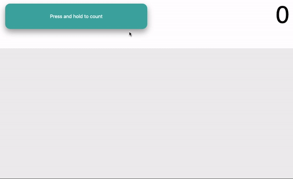

# JavaScript 1 - Module 2

## Lesson Task 4 Question

Using the HTML provided write code that does the following:

-   when the button is pressed and held down start a counter that increments by 1 every second
-   When the button is released stop the counter and create an amount of text boxes equal to the counter value
-   when the counter is pressed and held down again set the counter to 0, clear the text inputs and repeat the previous step

Example:

